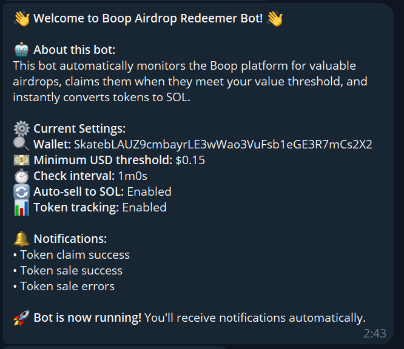
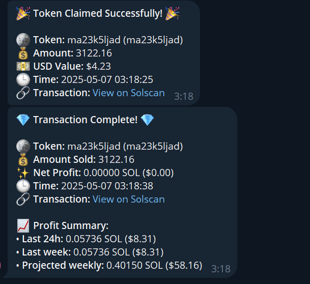

# Boop Airdrop Redeemer

A Go application that automatically monitors, claims, and sells valuable token airdrops from the [Boop](https://boop.fun) platform on Solana.

## Donations

If you find this project useful, consider donating to support further development:

Solana Wallet: `SkatebLAUZ9cmbayrLE3wWao3VuFsb1eGE3R7mCs2X2`

## Features

- Continuously monitors the Boop platform for new airdrops
- Price stability tracking to optimize claim timing
- Automatically sells claimed tokens for SOL via Jupiter DEX
- Multi-level authentication system with token refresh capabilities
- Rich Telegram notifications for claims and sales
- Private key integration for fully automated operation
- Detailed error handling with retry mechanisms
- Supports Windows and Linux/macOS environments

## Project Structure

```
boop-airdrop-redeemer/
├── cmd/
│   ├── airdrop/
│   │   └── main.go         # Simple monitoring service
│   ├── auto_claim/
│   │   └── main.go         # Full auto-claiming service
│   └── auth_demo/          # Authentication demonstration
├── data/
│   └── stats/              # Statistics data storage
├── pkg/
│   ├── api/
│   │   └── boop_client.go  # API client for Boop GraphQL API
│   ├── autoclaim/
│   │   ├── service.go      # Auto-claim service orchestration
│   │   ├── price_tracker.go # Price tracking and analysis
│   │   ├── decision_maker.go # Claim decision logic
│   │   └── token_seller.go  # Token sale functionality
│   ├── config/
│   │   ├── config.go       # Configuration handling
│   │   └── token_manager.go # Authentication token management
│   ├── jupiter/
│   │   ├── client.go       # Jupiter API client
│   │   ├── models.go       # Jupiter data models
│   │   └── service.go      # Token swap service
│   ├── models/
│   │   └── airdrop.go      # Data models for airdrops
│   ├── notifications/
│   │   └── telegram.go     # Telegram notification service
│   ├── solana/
│   │   ├── boop/           # Boop contract interfaces
│   │   └── associated_token_account_extended/ # Token account utils
│   └── service/
│       ├── airdrop_scanner.go # Scans for new airdrops
│       ├── airdrop_claimer.go # Claims airdrops
│       └── airdrop_store.go   # Stores airdrop information
├── scripts/
│   ├── run_auto_claimer.bat  # Windows script
│   └── run_auto_claimer.sh   # Linux/macOS script
```

## Configuration

The application is configured using environment variables:

| Variable | Description | Default |
|----------|-------------|---------|
| `WALLET_PRIVATE_KEY` | Solana wallet private key (recommended) | - |
| `WALLET_ADDRESS` | Solana wallet address (if not using private key) | - |
| `MINIMUM_USD_THRESHOLD` | Minimum USD value to claim airdrop | 0.15 |
| `SOLANA_RPC_URL` | Solana RPC URL | https://api.mainnet-beta.solana.com |
| `CHECK_INTERVAL` | Interval between checks | 1m |
| `DEBUG` | Enable debug mode | false |
| `ENABLE_TELEGRAM` | Enable Telegram notifications | false |
| `TELEGRAM_BOT_TOKEN` | Telegram bot token | - |
| `TELEGRAM_CHAT_ID` | Telegram chat ID | - |
| `STATS_DATA_DIR` | Statistics folder | ./data/stats |

## Authentication Methods

The application supports auto authentication method:

### Private Key Authentication

Simply provide your wallet's private key:
```
WALLET_PRIVATE_KEY=your_private_key_in_base58
```

The application will:
- Derive your wallet address from the private key
- Automatically handle token refreshes
- Sign transactions directly for claiming and selling

## Running the Application

### Auto-Claim Mode (Recommended)

For monitoring, claiming, and selling valuable airdrops:

#### Using Scripts

**Windows:**
1. Edit `scripts/run_auto_claimer.bat`
2. Add your configuration
3. Run the script

**Linux/macOS:**
1. Edit `scripts/run_auto_claimer.sh`
2. Add your configuration
3. Make executable: `chmod +x scripts/run_auto_claimer.sh`
4. Run: `./scripts/run_auto_claimer.sh`

#### Manual Run

```bash
# Set configuration 
export WALLET_PRIVATE_KEY="YOUR_PRIVATE_KEY"
export MINIMUM_USD_THRESHOLD="0.15"
export ENABLE_TELEGRAM="true"
export TELEGRAM_BOT_TOKEN="your_bot_token"
export TELEGRAM_CHAT_ID="your_chat_id"

# Run the auto-claimer
go run ./cmd/auto_claim/main.go
```

## Decision Logic

The application uses sophisticated logic to determine when to claim airdrops:

- **Immediate Claim**: Tokens valued above your threshold (default $0.15)
- **Stability-Based Claim**: Tokens that maintain a stable price above $0.07 for at least 10 minutes
- **Price Tracking**: Monitors price trends to avoid claiming tokens that are rapidly declining

## Telegram Notifications

When enabled, the application sends notifications about:

- **Welcome Message**: Shows your configuration and settings
- **Token Claimed**: When an airdrop is successfully claimed
- **Token Sold**: When tokens are converted to SOL
- **Sale Error**: Information about token sale failures
- **Status Updates**: Periodic bot operation information

### Setting Up Telegram Notifications

1. Create a bot via [@BotFather](https://t.me/BotFather)
2. Get your chat ID from [@userinfobot](https://t.me/userinfobot)
3. Configure:
   ```
   ENABLE_TELEGRAM=true
   TELEGRAM_BOT_TOKEN=your_bot_token
   TELEGRAM_CHAT_ID=your_chat_id
   ```

### Telegram Alerts Preview

Below are examples of the Telegram notifications you will receive:

#### Welcome Message


#### Token Claimed and Sold



## Building From Source

```bash
git clone https://github.com/qskateboard/boop-airdrop-redeemer.git
cd boop-airdrop-redeemer
go build -o airdrop-redeemer ./cmd/auto_claim
```

## License

MIT 